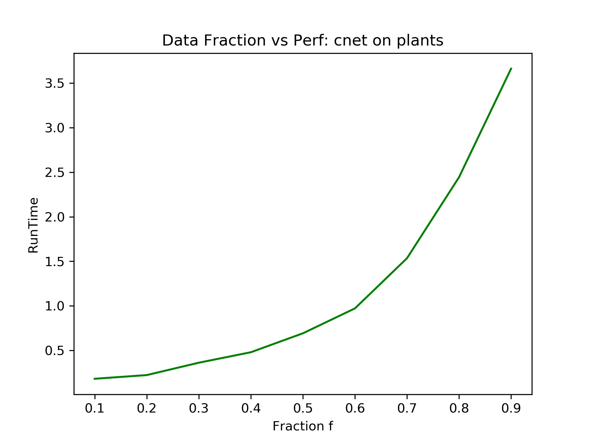
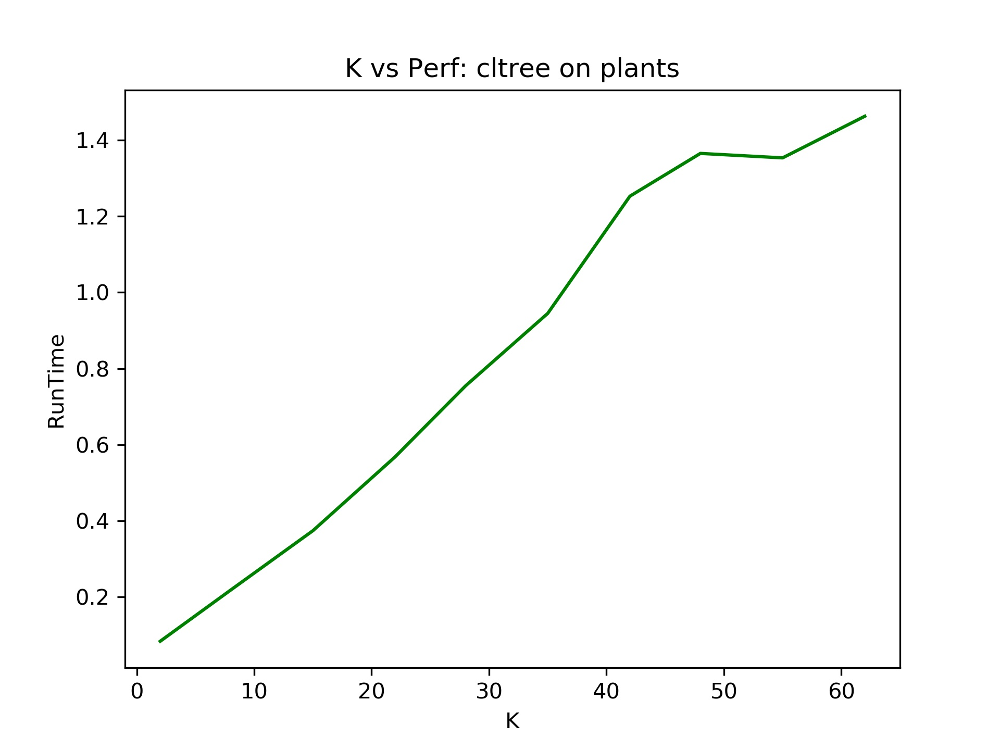
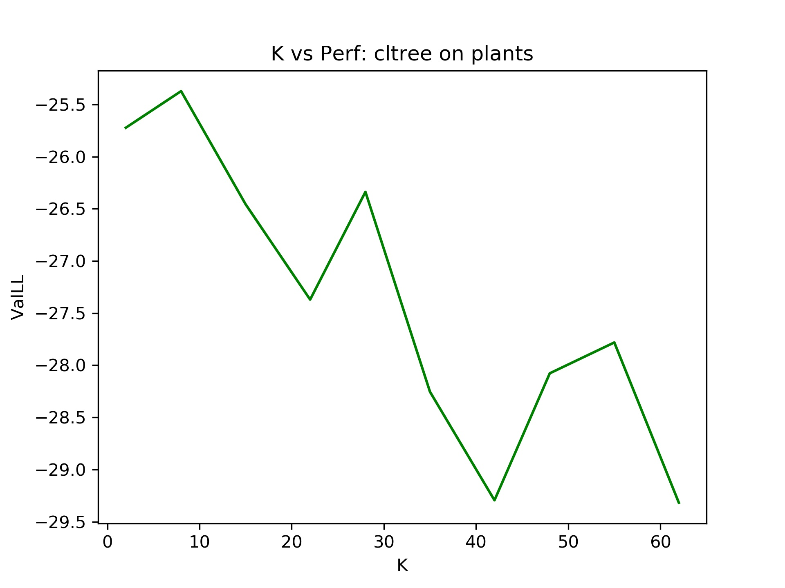

# Scaling the learning of Chow Liu trees in Cutset Networks

Ninad Arun Khargonkar (ninadarun.khargonkar@utdallas.edu)

## Introduction

Tractable probabilistic models are a class of probabilistic models which offer
polynomial time exact inference over many different model queries. Such models have been the focus
of recent research in probabilistic modeling for example, the sum product network [4] and
the cut-set network [2]. We base our project on scaling the learning process
of cutset networks. Cuset networks are basically OR trees with a tree Bayesian
network (Chow-Liu tree) at their leaves which enables fast linear time inference. The Chow-Liu 
algorithm [1] is used to
learn the tree Bayesian network from the training data, hence the name "Chow Liu
tree" which we will in this document refer to tree bayesian network learned
using the Chow Liu algorithm.

Although tractable structure-learning is an attractive property of tree networks,
learning a Chow-Liu tree is quadratic in the number of 
feature variables and this cost can be prohibitive in scaling the learning
process of cutset networks to larger and higher dimensional data sets. We introduce approximations
to this method with sub-quadratic cost in data and number of features by imposing a
structure to tree through the calculation of a spanning tree.
Scaling this algorithm is an important problem since its a part of a larger
learning routine in cutset networks, therefore it can also prove to be a 
bottleneck in other variants of cutset networks [6, 7].

## Problem Statement

Learning a cutset network from data $d$ involves two parts: a global OR tree and Chow Liu trees
at leaves. The OR tree is learned using the information gain greedy
heuristic which selects the variable having maximum information gain. This puts
the running time for OR tree as $O(n^2 d)$.
The Chow Liu algorithm learns a tree network $T(x)$ from the training data in 
order to match the true probability distribution $P$ over a set $V$ of variables
with $|V| = n$. The probability for any vector $x$ is then as follows:

$$ T(x) = \prod_{v \in V} T(x_v \; | \; x_{pa(v)})$$

A "good" tree structure $T$ will be close to the true underlying data distribution
$P$ and the key observation of the Chow-Liu algorithm was that the Kullback-Leibler
divergence between $P(x)$ and $T(x)$ is minimized as a result of each edge of
the tree maximizing the total mutual information which is nothing but the sum
of mutual information between the nodes in all edges of the tree.
The algorithm proceeds by first creating a clique $G$ with the nodes as
the variables and the edge weights representing the mutual information for the pair
of nodes in that edge. Then it computes the maximum weight spanning tree $G_T$
of $G$ to learn the structure of the tree whereas the parameters, $T(x,y)$ (joint 
probability distributions for each $(x,y)$ edge) are equal to $P(x,y)$ which is
empirical distribution from the data $d$. $G_T$ is usually learned by using a standard
*minimum spanning tree* algorithm (negating the edge weights) like Prims or 
Kruskal which take $O(E \log V)$ time with $|E| = \frac{n (n-1)}{2}$ for 
graph $G$.

Computing the entire clique $G$ also requires first computing $O(n^2)$ mutual information pairs
with each pair taking one pass over the data $d$ giving us a total of $O(n^2 d)$
which dominates the total running time of the algorithm. This run time is the best we can do in 
finding the exact tree structure. In order to reduce it, we need to forgo 
computing some mutual information pairs which will result in less edge weight 
computations making the graph $G$ not as dense.

It can be seen that since the minimum
spanning tree algorithm (mst) depends on the edges in the original graph, a cost
reduction can be obtained by starting out with an "incomplete" graph through
random sampling methods and then learning an exact mst of the incomplete graph. 
Another approach would to compute the approximation to mst directly, by building 
the tree one edge at a time in a greedy manner. In order to make the OR tree
structure learning faster, we plan to use only a sample of the data for computing
the information gains and then selecting the best attribute for splitting the 
data set.

## Approximation Methods

We try out two schemes for learning an approximation to the Chow Liu tree along 
with learning the OR tree with only a fraction of data points. These will be 
used in cutset network learning algorithm as part of the leaf node computation
routine.

### Approx Tree (AT)
In this method we directly compute a spanning tree of the graph. Since its an
approximate method, we are no longer guaranteed to get a minimum spanning tree.
We build the tree in $n - 1$ steps where at each step we add an edge for
the spanning tree and meanwhile also ensuring that all the nodes are covered. We start
with a random root node and then select $K$ neighbors for it randomly. Out of 
the $K$ nodes, we pick the node having the highest mutual information with the
root and add an edge for them. At the next iteration, we select the root from
the nodes in the tree being built and go on in a similar manner until we add 
$n-1$ edges to get the spanning tree. We maintain the tree structure through
a `parents` array which tracks the parent for each node. At each step of the 
loop, we spend $O(dK)$ time in computing the $K$ mutual information pairs thereby
giving us a total running time of $O(ndK)$.
The algorithm pseudo code is shown below:

~~~python
root = select(nodes, 1)
tree_nodes.add(root)
nodes.remove(root)
edges = 0
parent[root] = -1
while edge_count < n-1:
    if len(nodes) <= K: 
        candidates = nodes  
    else:            
        candidates = select(nodes, K)
    best_node = BestNode(root, candidates)                        
    tree_nodes.add(best_node)
    nodes.remove(best_node)
    parent[best_node] = curr_node
    edge_count += 1            
    curr_node = select(tree_nodes, 1)
~~~

### Approx Graph (AG)
The Chow Liu algorithm uses a complete graph between the $n$ variables. Instead
of computing all $n^2$ edges, we create an incomplete graph by not computing all
the mutual information pairs. This is motivated by the random edge sampling 
method as described in [5]. Random edge sampling directly samples $K$ edges
(as $K$ node pairs) and uses this as an approximation to graph $G$. However, there
is a chance of having isolated nodes in the graph making is disconnected (which
would make the mst a forest!). In order to avoid this, we construct the graph
in a step wise manner by building up a sort-of-dense tree in a similar as seen
in previous section. However, we do not throw away any edges and keep all $K$
of them for each iteration and we also stop the iterations once we have completed
$n$ steps. 
After computing the graph, we feed it to an exact mst 
algorithm to get the desired tree. At each step we spend $O(dK)$ time for the 
mutual information pairs and the loop runs for $n$ steps, with each step
adding $K$ edges to the graph giving us total of $nK$ edges. Here too the running
time is $O(ndK)$ since $d$ dominates the log term in mst calculation. 
The algorithm pseudo code is shown below:

~~~python
curr_node = select(nodes, 1)
graph_nodes.add(curr_node)
steps = 0
flag = 0
while nodes or steps < nvars-1:
    if flag == 1:        
        candidates =  select(graph_nodes, K)            
    elif len(nodes) <= samp_k:    # Stop sampling!
        candidates = nodes  
    else:            
        candidates = select(nodes, K)

    for e in candidates:
        score = MutualInfo(curr_node, e)
        adjmat[curr_node, e] = score
        adjmat[e, curr_node] = score

    if flag == 0:
        graph_nodes.add(candidates)
        nodes = nodes \ candidates
    if nodes.empty():
        flag = 1                
    steps += 1
    curr_node = select(graph_nodes, 1)
~~~

## Experimental Evaluation

We evaluated our algorithms on nine binary valued data sets as seen in the two
tables below.
There is wide range for both $n$ and $d$ across all the data sets and hence they 
are representative enough and potentially give us an insight into different use 
cases.
The evaluation metrics were the test set log likelihood and the running time 
for training the model and 10 repeated runs were used to compute these values
and their average is reported.
For all algorithms we used 1-Laplace smoothing to avoid numerical errors and
tuned the fraction $f$ (for OR tree learning) using the validation data. 
The fraction values considered were: `[0.1, 0.2, 0.3, 0.4, 0.5, 0.6, 0.7, 0.8, 0.9]`.
Note that $K$ is not necessarily a good hyper parameter here since we expect the model 
runtime to go up as $K$ approaches $n$ and asymptotically the runtimes match if
$K=n$. Therefore we set its value as the
ceiling of $K = \log n$, which results in the runtimes being sub-quadratic
in $n$. We ran a preliminary experiment on the `plants` dataset to see the 
effect of different $K$ values and data sampling fractions on the algorithm 
runtime and validation data log likelihood. The model for trying out the 
different $K$ values was just the Approx Tree i.e not used as a part of cutset 
network.

{ width=50% }
{ width=50% }

{ width=50% }
{ width=50% }

### Baselines

The baseline experiments were the standard chowliu tree and cutset networks 
along with independent bayesian networks which acted as a sanity check for our 
approximation methods (and also like a crude but acceptable lower bound). 
Our hypothesis was that the approximation methods should have better run time
while suffering a slight drop in test set log likelihood performance.

## Results

The run times (in seconds) for the different methods for each data set are
presented in Table-1 while the test set log-likelihoods are shown in Table-2.
For each data set, the bold entries indicates the lowest value for the running 
time and the highest value for test set log-likelihood in tables 1 and 2 
respectively. Independent Bayesian Networks were omitted from the run time table
since the values are often very close to zero and do not help much in the 
analysis. 
The codes used in the tables for the different 
experiment names are as follows:

- IndepBN: Independent Bayesian Networks
- CLTree: Chow Liu Tree alogorithm
- CNet: Cutset network (no pruning)
- fCnet + AT: Cutset network (with sampling for OR tree) + Approx Tree method
- fCnet + AG: Cutset network (with sampling for OR tree) + Approx Graph method

Table: Runtime for the algorithms across all the datasets (in seconds)

| **Dataset** | **# Var** |  **# Trn**  |  **CLTree**  |  **CNet**  |  **fCnet + AT**  | **fCnet + AG**  | 
|-------------+-----------+-------------+--------------+------------+------------------+-----------------|
| nltcs | 16 |  16181  |  **0.03952**  |  0.17773  |  0.04354  | 0.05741  | 
| msnbc | 17 |  291326 |  0.78711  |  2.59293  |  **0.37496**  | 0.39212  | 
|plants | 69 |  17412  |  0.29355  |  2.14429  |  **0.18305**  | 0.24551  | 
|jester | 100|  9000   |  **0.29244**  |  1.92556  |  0.31162  | 0.40367  | 
| audio | 100|  15000  |  0.48968  |  3.51331  |  **0.39658**  | 0.49917  | 
|netflix| 100|  15000  |  **0.48851**  |  3.61621  |  0.52049  | 0.56322  | 
|accidents|111|  12758 |  **0.50744**  |  4.63285  |  0.71558  | *8.70181*  | 
|  dna  | 180|  1600   |  **0.15916**  |  1.01499  |  0.37915  | 0.54568  | 
|reuters52|889|  6532  |  17.6617  |  225.748  |  **4.51495**  | 6.40184  | 

Table: Test set log-likelihoods for the algorithms across all the datasets

| **Dataset** | **IndepBN** |  **CLTree**  |  **CNet**  |  **fCnet + AT**  | **fCnet + AG**  | 
|-------------+-----------+--------------+------------+------------------+-----------------|
| nltcs |  -9.23362  |  -6.75904  |  -5.91823  |  -5.55817  | **-5.44865**  |
| msnbc |  -6.77014  |  -6.54012  |  -6.12911  |  **-4.75659**  | -5.10283  | 
|plants |  -31.2662  |  -16.5241  |  -13.4008  |  **-9.68081**  | -10.5392  | 
|jester |  -63.8834  |  -58.2265  |  -58.1917  |  -49.9633  | **-49.5859**  | 
| audio |  -49.3368  |  -44.3749  |  -43.9848  |  **-37.2985**  | -37.7936  | 
|netflix|  -64.5614  |  -60.2503  |  -62.4992  |  **-50.8655**  | -51.0449  | 
|accidents|-45.5596  |  -33.1881  |  **-31.9951**  |  -33.6356  | -32.8759  | 
|  dna  |  -100.386  |  -87.7347  |  -96.6158  |  **-78.8981**  | -80.8926  | 
|reuters52|-112.626  |  -97.5372  |  -92.8065  |  **-42.3804**  | -48.6373  |

### Algorithm Learning Time

As expected the standard Chow-Liu tree algorithm is the fastest for five out of the 
nine datasets. The approximation methods on cutset networks (fCnet + AT, AG)
too show a big drop in runtime (compared to CNet) with sometimes even being the 
astest method for a particular dataset with the drop being more evident on
larger datasets like `reuters52`. The AT method is naturally faster amongst the
two approx methods since it computes the spanning tree on the fly whereas AG 
computes a mst from an less dense graph -- involving more edge calculations and
tree structure learning. The sampling of data for OR tree might also helping
the two approx methods since the calculation of information gain is prohibitive
cost in the overall running time.
An anomolaous result is the running time for fCnet + AG with the `accidents` data.
Its runtime is higher than other algorithms by a large magnitude and may be due to a 
bug in runtime calculation while the program was running!

### Algorithm Predictive Performance

The predictive performance of the approximation method (measured through their
log likelihood scores) comes out quite well, sometimes even being the best of all!
This was not entirely expected since a worse result than CNet with a slightly
better run time was expected. Here too AT is the winner among the 5 methods
for majority of the data sets. This might be due to higher ability for generalization
(and consequently lower overfitting) from the inherent randomization in the 
model which helps pick out pairs which might have never been picked for the tree
edges when considering all the $n^2$ pairs and selecting only the high scoring ones. 
This is also clear from the preliminary experiments (earlier figures) where increasing $K$ does
not necessarily lead to better performance on validation data as it might be 
leading to overfitting.
Even when AT and AG methods don't stand
out as the clear winners (eg. for `accidents` data), their performance is quite close
to the overall best performer.

## Discussion

We introduced 2 approximation schemes and analyzed their running time 
and log likelihood (predictive) performance on nine binary data sets. The results
seem to have followed our hypotheses of the gain in running time. A pleasant
surprise was the superior performance in test set log likelihoods across
majority of the datasets. 
Scaling the learning process by making it sub-quadratic or even linear time 
is an important step in making these models suit to bigger and diverse datasets. 

The current approximation
schemes are randomized methods at heart and hence future work includes integrating
them into a mixture setting and performing pruning on the 
trees to perhaps learn even better models. The approximation methods can further
be modified based on sparsity assumptions in the data as seen in [3] or 
through different sampling heuristics [4]. One can even adopt a more aggressive 
approximation scheme but the order $d$ term (from computing the mutual
information between any pair of variables) largely cancels out any gains from
computing the minimum spanning via a fast method pointing towards the need to
approximate the mutual information for each variable pair. 

## References

1. Chow, C., and Cong Liu. "Approximating discrete probability distributions with dependence trees." IEEE transactions on Information Theory 14.3 (1968): 462-467.

2. Rahman et al, “Cutset Networks: A Simple, Tractable, and Scalable Approach for Improving the Accuracy of Chow-Liu Trees", ECMLPKDD, 2014.
   
3. Meil et al, “An accelerated Chow and Liu algorithm: fitting tree distributions to high-dimensional sparse data", ICML, 1999.
   
4. Poon, Hoifung, and Pedro Domingos. "Sum-product networks: A new deep architecture." 2011 IEEE International Conference on Computer Vision Workshops (ICCV Workshops). IEEE, 2011.
   
5. Ammar, Sourour, et al. "Sub-quadratic Markov tree mixture learning based on randomizations of the Chow-Liu algorithm."
   ,PGM, 2010.

6. Mauro et al, "Multi Label Classification with Cutset Networks", PGM, 2016.

7. Rahman et al, “Learning Ensembles of Cutset Networks,” AAAI 20 16.

